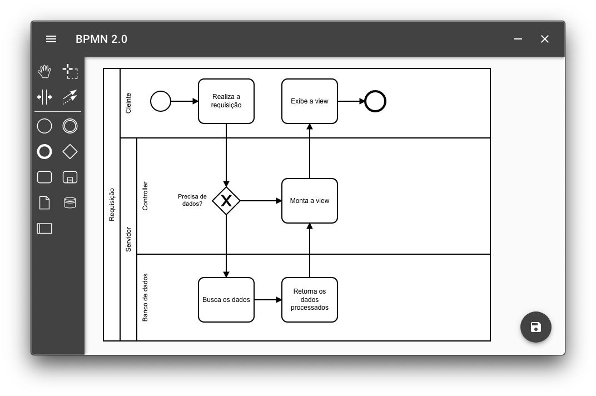

# Free BPMN

Software gratuito multiplataforma para criação de diagramas BPMN.



Ajude o desenvolvimento deste software.

Você precisa saber um pouco de:


- Electron

- Vue

- Vuetify

- BPMN 2.0

```bash
# clone repo
git clone https://github.com/danielbonifacio/free-bpmn

# navega para o diretorio do projeto
cd free-bpmn

# instala as dependências e inicia o servidor de desenvolvimento
npm i && npm run dev
```

## Funcionalidades

- Modelar diagrama BPMN
- Armazena na memória o último diagrama aberto
- Importar modelos BPMN externos
- Exportar modelos BPMN em arquivos `.bpmn`e `.svg`


Este software foi construído utilizando a base open source do [bpmn-io](https://github.com/bpmn-io) (camunda).
